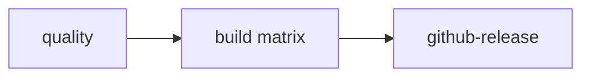

# CI and releases

This document describes **`.github/workflows/ci.yml`** and **`.github/workflows/release.yml`**.  
Application build semantics (Go `c-shared`, `$OUT_DIR`, cross-compile) are in **[BUILD.md](BUILD.md)**.

## CI (`ci.yml`)

**Triggers:** `push` and `pull_request` to **`main`** or **`master`**.

**Concurrency:** one run per workflow + ref; newer runs cancel in-progress ones on the same ref.

| Job | Runner | What it does |
|-----|--------|----------------|
| **`fmt`** | `ubuntu-latest` | `cargo fmt --all --check` (no Go). |
| **`clippy`** | `ubuntu-linux` | Go from **`mihomo-sys/builder/go.mod`**, **gcc** for CGO, then `cargo clippy --workspace --all-targets -- -D warnings`. Ensures **`mihomo-sys/build.rs`** + **`go build`** path works on Linux. |
| **`test`** | matrix: **Linux / macOS / Windows** | Go + CGO (**gcc** on Linux, **MinGW** on Windows), then `cargo test --workspace`. Builds **`mihomo-sys`** (vendored Go shared lib) and runs tests including **`integration/it_works`** where applicable. |

**Note:** **`fmt`** does not need Go. **`clippy`** and **`test`** need Go and a C toolchain so **`mihomo-sys`** can run **`go build -buildmode=c-shared`**.

## Release (`release.yml`)

**Triggers:** **tag push** matching **`v*`** (e.g. `v0.1.0`).

**Permissions:** `contents: write` (upload release assets).

### Flow

1. **`quality`** (Ubuntu): `cargo fmt --check`, `cargo clippy`, `cargo test --workspace` — same gate as CI before producing binaries.
2. **`build`** (needs `quality`): **parallel matrix** — one job per row:

   | Runner | `slug` (artifact name) | Rust target (implicit) |
   |--------|-------------------------|---------------------------|
   | `ubuntu-latest` | `linux-x86_64` | `x86_64-unknown-linux-gnu` |
   | `macos-latest` | `darwin-aarch64` | `aarch64-apple-darwin` |
   | `macos-13` | `darwin-x86_64` | `x86_64-apple-darwin` |
   | `windows-latest` | `windows-x86_64` | `x86_64-pc-windows-gnu` (MSVC toolchain + MinGW for CGO) |

   Each job: checkout → Rust stable → Go → OS-specific CGO deps →  
   **`cargo build --release -p it_works`**.

   That compiles **`mihomo-sys`** and places **`libmihomo`** under  
   **`target/release/build/mihomo-sys-*/out/dylib/<goos>-<goarch>/`** (see [BUILD.md](BUILD.md)).

   Packaging:
   - **Unix:** `tar.gz` + `sha256` containing `LICENSE`, `it_works`, and the dylib/so.
   - **Windows:** `zip` + `sha256` containing `LICENSE`, `it_works.exe`, `mihomo.dll`.

   Artifacts are uploaded as **`dist-<slug>`** (e.g. `dist-linux-x86_64`).

3. **`github-release`** (needs `build`): downloads all **`dist-*`** artifacts, then **`softprops/action-gh-release`** uploads **`mihomo-rust-<tag>-<slug>.*`** to the GitHub Release. **`prerelease`** is true if the tag name contains **`-`**.

## See also

- **[BUILD.md](BUILD.md)** — local and cross-compilation flow, `$OUT_DIR`, **`MIHOMO_LIB_DIR`**.
